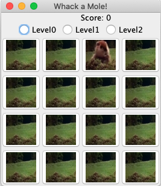

# Whack A Mole
A Java game with a scoreboard system played with a mouse clicker. Hit the mole to gain a high score. 

You start the game with 0 points. 
If you hit the mole, your score increases by 10 points. 
If you miss, your score decreases by 5 points. 

Built the GUI with Java Swing components, arrays, and loops in Java.
